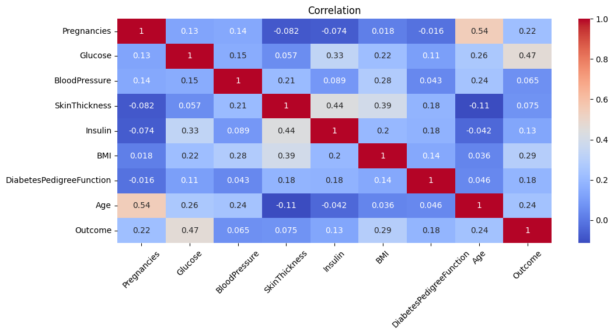
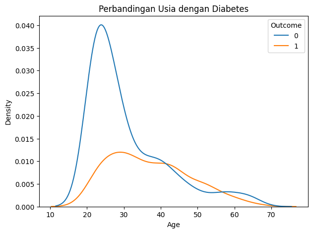
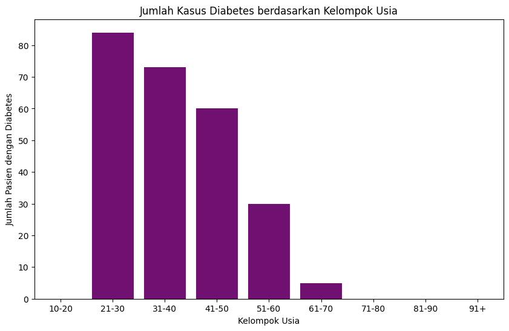
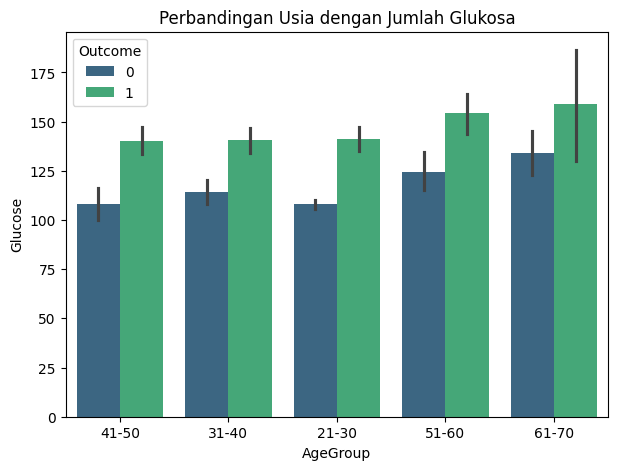

# Diabetes_Analysis

Repositori ini berisi sistem analisis dan prediksi diabetes menggunakan machine learning. Proyek ini mencakup proses pembersihan data, eksplorasi, pelatihan model, hingga visualisasi berbasis web dengan Streamlit.

---

## Penjelasan Program

Tujuan dari proyek ini adalah:
- Menganalisis faktor-faktor medis yang memengaruhi kemungkinan seseorang mengidap diabetes.
- Membangun model prediksi diabetes dari fitur seperti jumlah kehamilan, kadar glukosa, BMI, usia, dll.
- Menyediakan visualisasi pengguna berbasis Streamlit untuk hasil prediksi.

---

## Struktur File dan Fungsinya

| Nama File             | Deskripsi                                                                 |
|----------------------|---------------------------------------------------------------------------|
| `app.py`             | File utama Streamlit Web App                                              |
| `notebook.ipynb`     | Notebook Jupyter untuk EDA, preprocessing, dan training model             |
| `diabetes_data.csv`  | Dataset utama yang dianalisis                                             |
| `diabetes_model.pkl` | Model machine learning hasil pelatihan                                    |
| `scaler.pkl`         | Objek StandardScaler untuk preprocessing                                  |
| `README.md`          | Dokumentasi proyek                                                        |

---

## Menjalankan Aplikasi Streamlit

- Pastikan sudah `app.py` `diabetes_model.pk` dan `scaler.pkl`
- Pastikan path terminal sudah sesuai dengan path filenya
- jalankan script ini pada terminal

```
streamlit run app.py
```

apabila tidak bisa, gunakan ini:

```
python -m streamlit run app.py
```

Atau versi streamlit online :

🔗 [Link Streamlit App](https://diabetes-analysis-farhanqf.streamlit.app/)

---

## Instalasi Library

Apabila menggunakan local untuk menjalankan baik notebook atau app nya, pastikan semua library berikut sudah terpasang, gunakan script:

```
pip install pandas numpy matplotlib seaborn joblib imbalanced-learn scikit-learn xgboost
```

---

## Visualisasi

### Korelasi Antar Kolom



### Distribusi Usia dengan Penderita Diabetes



### Distribusi Rentang Usia terhadap Penderita Diabetes



### Distribusi Rentang Usia terhadap Jumlah Glukosa yang dimiliki



---

## Kesimpulan

* Glukosa adalah faktor paling berpengaruh terhadap Outcome dibanding faktor yang lain.
* Faktor keturunan (`DiabetesPedigreeFunction`) meskipun tidak memiliki korelasi yang tinggi, tetapi perlu diperhatikan juga, karena dari banyak riwayat yang terjadi, banyak berkontribusi pada risiko.
* Model prediktif yang dibuat dan di integrasikan menggunakan library `streamlit`, dapat digunakan sebagai alat bantu untuk mempermudah diagnosis awal diabetes.
---

## Kontribusi

Proyek ini dikembangkan oleh [Ahmad Farhan (iniparhan)](https://github.com/iniparhan) sebagai bagian dari pembelajaran data science dan penerapan machine learning di bidang kesehatan.
