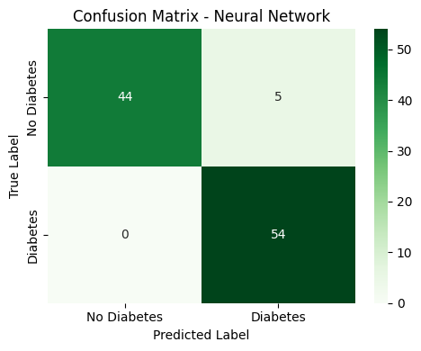

# Diabetes_Analysis

Repositori ini berisi sistem analisis dan prediksi diabetes menggunakan machine learning. Proyek ini mencakup proses pembersihan data, eksplorasi, pelatihan model, hingga visualisasi berbasis web dengan Streamlit.

## Penjelasan Program

Tujuan dari proyek ini adalah:
- Menganalisis faktor-faktor medis yang memengaruhi kemungkinan seseorang mengidap diabetes.
- Membangun model prediksi diabetes dari fitur seperti jumlah kehamilan, kadar glukosa, BMI, usia, dll.
- Menyediakan visualisasi pengguna berbasis Streamlit untuk hasil prediksi.

## Struktur File dan Fungsinya

| Nama File             | Deskripsi                                                                 |
|----------------------|---------------------------------------------------------------------------|
| `app.py`             | File utama Streamlit Web App                                              |
| `notebook.ipynb`     | Notebook Jupyter untuk EDA, preprocessing, dan training model             |
| `diabetes_data.csv`  | Dataset utama                                                             |
| `diabetes_model.pkl` | Model machine learning hasil train                                        |
| `scaler.pkl`         | Objek StandardScaler untuk preprocessing                                  |
| `README.md`          | Dokumentasi proyek                                                        |

## Menjalankan Aplikasi Streamlit

Berikut langkah-langkah untuk menjalankan aplikasi secara lokal:

1. Pastikan file berikut sudah tersedia:
   - `app.py`
   - `diabetes_model.pkl`
   - `scaler.pkl`
2. Buka terminal dan arahkan direktori kerja ke folder yang berisi file tersebut.
3. Jalankan perintah berikut di terminal:

```
streamlit run app.py
```

apabila tidak bisa, gunakan ini:

```
python -m streamlit run app.py
```

Atau versi streamlit online :

🔗 [Link Streamlit App](https://diabetes-analysis-farhanqf.streamlit.app/)

## Instalasi Library

Apabila menggunakan local untuk menjalankan baik notebook atau app nya, pastikan semua library berikut sudah terpasang, gunakan script:

```
pip install pandas numpy matplotlib seaborn joblib imbalanced-learn scikit-learn xgboost
```

---

## Visualisasi

### Korelasi Antar Kolom


### Distribusi Usia dengan Penderita Diabetes


### Distribusi Rentang Usia terhadap Penderita Diabetes


### Distribusi Rentang Usia terhadap Jumlah Glukosa yang dimiliki


## Train Model

Proses pelatihan model dilakukan dengan membandingkan beberapa algoritma machine learning.

Setiap model diuji menggunakan teknik validasi silang (`StratifiedKFold`) dan metrik evaluasi seperti **accuracy**, **precision**, **recall**, **F1-score**, dan **ROC-AUC** untuk memastikan performa yang adil dan menyeluruh.

Setelah dibandingkan, model dengan performa terbaik adalah **Neural Network (Multi-layer Perceptron)** yang mampu menghasilkan akurasi tinggi dalam mengklasifikasikan pasien dengan dan tanpa diabetes.

Berikut adalah hasil **Confusion Matrix** dari model terbaik tersebut:



Model yang telah dilatih kemudian disimpan dalam format `.pkl` dan diintegrasikan ke dalam aplikasi berbasis Streamlit, sehingga dapat digunakan untuk prediksi secara langsung oleh pengguna.

## Kesimpulan

Berdasarkan hasil eksplorasi data dan analisis yang dilakukan, dapat disimpulkan bahwa:

- **Kadar glukosa (Glucose)** merupakan faktor yang paling dominan dalam menentukan `Outcome` (terdiagnosis diabetes atau tidak). Hal ini terlihat dari korelasi yang kuat serta distribusi nilai glukosa yang jauh lebih tinggi pada pasien dengan diabetes dibandingkan yang tidak.
  
- **Faktor keturunan**, yang direpresentasikan melalui `DiabetesPedigreeFunction`, memang tidak menunjukkan korelasi linear yang tinggi terhadap `Outcome`. Namun demikian, faktor ini tetap penting untuk diperhatikan, karena secara historis, banyak kasus diabetes ditemukan pada pasien dengan riwayat keluarga yang serupa. Dengan kata lain, meskipun tidak dominan secara statistik, faktor keturunan tetap memberikan kontribusi terhadap risiko diabetes.

- Model prediktif yang dikembangkan dalam proyek ini, dan telah diintegrasikan dalam antarmuka web menggunakan **Streamlit**, dapat berfungsi sebagai **alat bantu diagnosis awal**. Aplikasi ini memungkinkan pengguna, baik praktisi medis maupun non-teknis, untuk melakukan prediksi secara cepat dan mudah berdasarkan input fitur dasar seperti jumlah kehamilan, kadar glukosa, BMI, usia, dan riwayat keturunan.

Diharapkan repositori ini dapat digunakan sebagai langkah awal untuk deteksi dini risiko diabetes, sebelum dilakukan pemeriksaan lebih lanjut oleh tenaga medis profesional.
